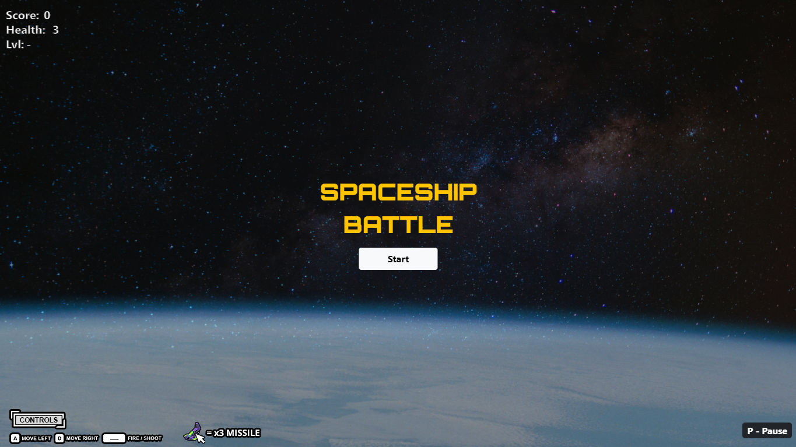
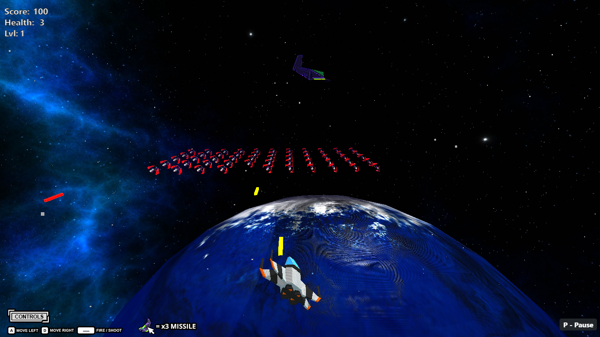
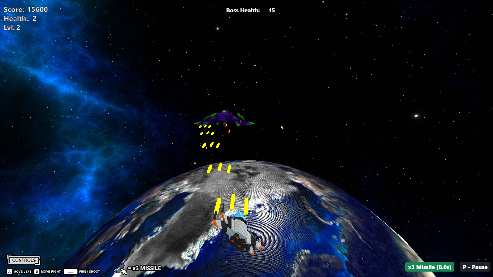

# Spaceship Battle (A Game Made using Three.js)
FP Grafkom B10 21/22

## About The Game
The goal of this game is to get the highest score and by shooting a collection of alien spaceships. The player will control a spaceship that can move left (A) and right (D) and fire missiles (Spacebar). Every time the level increases, players will meet bosses at even levels and alien groups at odd levels that are increasingly difficult and challenging. Inspired by Space Invaders Game (1978).

## Play Spaceship Battle
[Play the game!](https://oni4hmad.github.io/fp-grafkom-spaceship_battle/)

## Screenshots

## Credits
3D Models
* [Amazing Low Poly Player's Spaceship](https://sketchfab.com/3d-models/low-poly-spaceships-9177fe4356e4451485dc6129c9904eb9)
* [Gorgeous Low Poly Aliens Spaceship](https://sketchfab.com/3d-models/pixel-low-poly-spaceship-3-8d54be9049ca4aa99041a0936b8e6db2)
* [Beautiful Scorpio Spacehip](https://sketchfab.com/3d-models/scorpio-c1c2cec3e95c429c96a9e59b9b84d4fc)
* [Epic Earth](https://sketchfab.com/3d-models/earth-8a3f6e66955e41d48762d75725d3ab52)

Skybox
* [Space Skybox](https://opengameart.org/content/space-skyboxes-0)